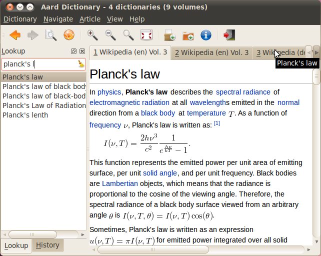
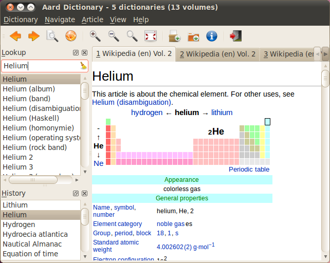
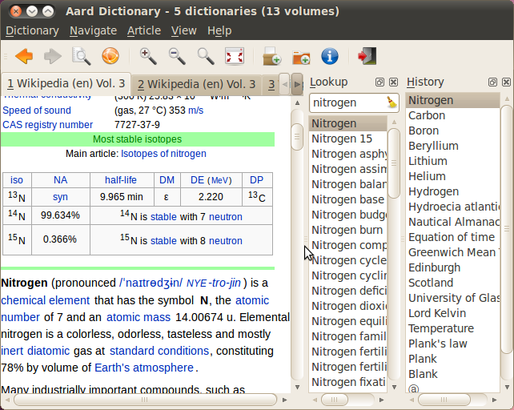
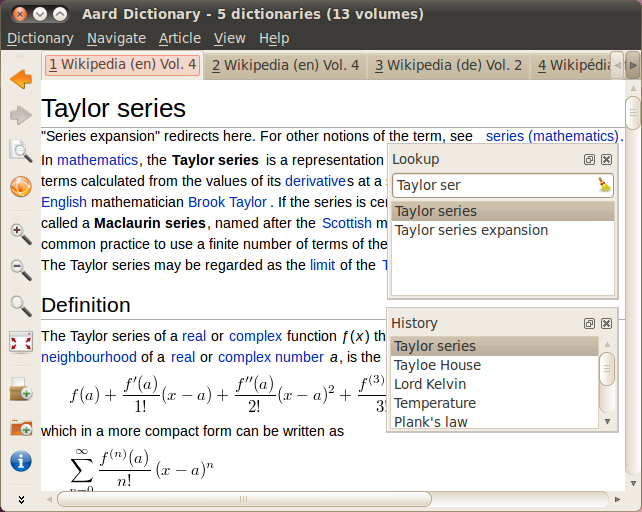
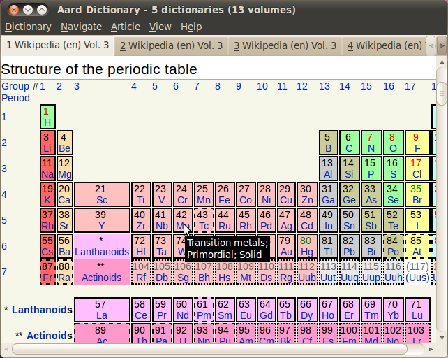
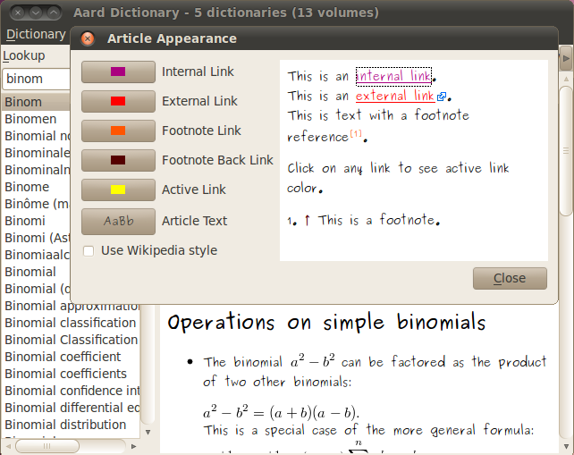
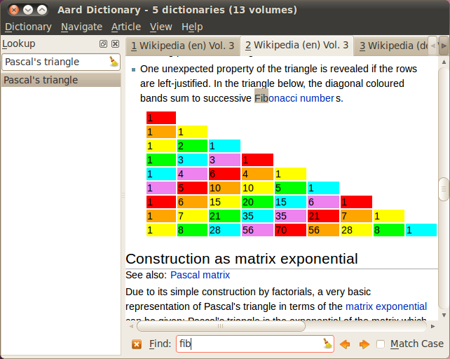
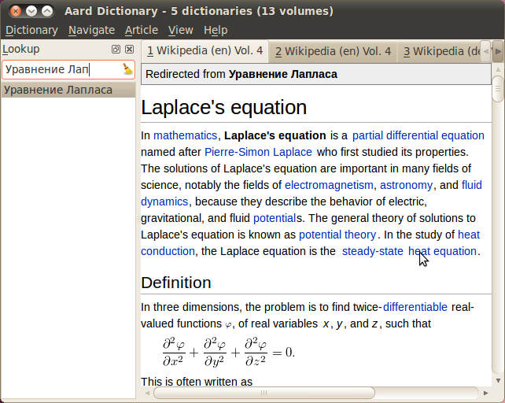
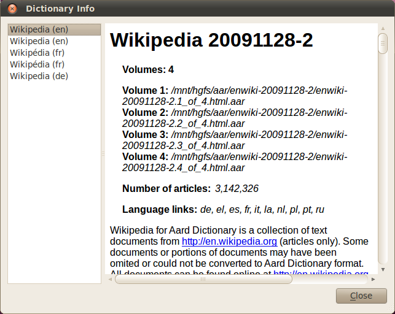
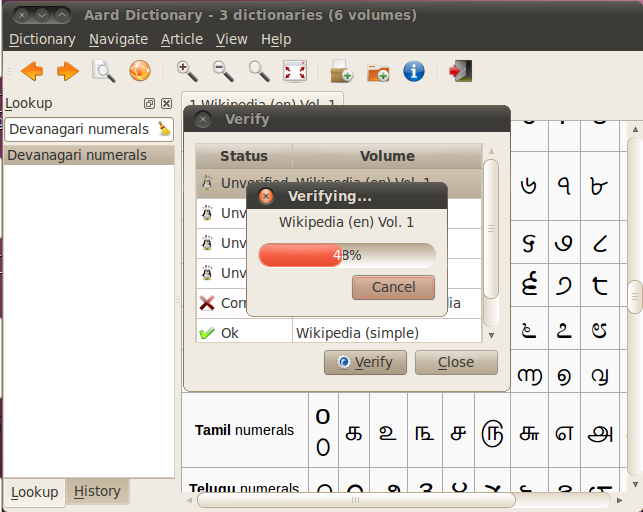

===============
Aard Dictionary
===============

Overview
============
Aard Dictionary's user interface consists of lookup and history pane
(initally grouped into tabs), article pane, toolbar and menu.

First open some dictionaries, either by selecting
:menuselection:`Dictionary --> Add Dictionaries` or
:menuselection:`Dictionary --> Add Directory`. Adding a directory means
that Aard Dictionary will scan that directory (without subdirectories)
and open any dictionaries it finds every time it is started.

Dictionaries have `.aar` extension. Dictionaries in newer :term:`aar-HTML`
format have double extension `.html.aar`, while dictionaries in older
:term:`aar-JSON` format have single `.aar` extension.

Start typing a word to look up in `Lookup Box`. List of matching words
appears below `Lookup Box` and is updated when typing is paused, best
matches displayed first (at the top of the list) and first match
automatically selected. Articles with similar titles found in one or
more dictionaries are grouped together and are display in multiple
tabs in article pane when selected.

Lookup pane, history pane and toolbar can be rearranged and moved to a new
position (click pane's title bar or toolbar's drag handle and start
dragging), either docked around article pane:

or floating:

Lookup pane, history pane and toolbar can also be hidden
(through :menuselection:`View` menu, close button in lookup and history pane's
title bar, or context menu over menu bar, tool bar or lokup and
history title bars).

Article visual style can be customized with `Article Appearance`
dialog (:menuselection:`Article --> Appearance...`).

.. seealso:: `Article Appearance`_

:menuselection:`Article --> Find` brings up `Find` bar:

Matching text in current article is selected as user types. Use `Find`
bar's arrow buttons or :kbd:`Shift+Enter`/:kbd:`Enter` to select
previous/next occurence of the phrase. Hide `Find` bar with the close
button or :kbd:`Esc`.

Keyboard Navigation
===================

Application Shortcuts
---------------------

+---------------------+-------------------------------------+---------------------------------+
|Key Sequence         |Action                               |Notes                            |
+=====================+=====================================+=================================+
|:kbd:`Ctrl+O`        |:menuselection:`Dictionary --> Add   |                                 |
|                     |Dictionaries`                        |                                 |
+---------------------+-------------------------------------+---------------------------------+
|:kbd:`Ctrl+Shift+O`  |:menuselection:`Dictionary --> Add   |                                 |
|                     |Directory`                           |                                 |
+---------------------+-------------------------------------+---------------------------------+
|:kbd:`Ctrl+R`        |:menuselection:`Dictionary -->       |                                 |
|                     |Remove`                              |                                 |
+---------------------+-------------------------------------+---------------------------------+
|:kbd:`Ctrl+E`        |:menuselection:`Dictionary -->       |                                 |
|                     |Verify`                              |                                 |
+---------------------+-------------------------------------+---------------------------------+
|:kbd:`Ctrl+I`        |:menuselection:`Dictionary --> Info` |                                 |
+---------------------+-------------------------------------+---------------------------------+
|:kbd:`Ctrl+Q`        |:menuselection:`Dictionary --> Quit` |                                 |
+---------------------+-------------------------------------+---------------------------------+
|:kbd:`Ctrl+N`        |Move keyboard focus to lookup box    |                                 |
|                     |and clear it's content               |                                 |
|                     |                                     |                                 |
+---------------------+-------------------------------------+---------------------------------+
|:kbd:`Ctrl+Enter`    |:menuselection:`Edit --> Lookup`     |Lookup selected text in          |
|                     |                                     |dictionaries. Just like other    |
|                     |                                     |actions in `Edit` menu, this     |
|                     |                                     |applies to the widget that       |
|                     |                                     |currently has keyboard focus.    |
+---------------------+-------------------------------------+---------------------------------+
|:kbd:`Ctrl+X`        |:menuselection:`Edit --> Cut`        |                                 |
+---------------------+-------------------------------------+---------------------------------+
|:kbd:`Ctrl+C`,       |:menuselection:`Edit --> Copy`       |                                 |
|:kbd:`Ctrl+Insert`   |                                     |                                 |
+---------------------+-------------------------------------+---------------------------------+
|:kbd:`Ctrl+V`,       |:menuselection:`Edit --> Paste`      |                                 |
|:kbd:`Shift+Insert`  |                                     |                                 |
+---------------------+-------------------------------------+---------------------------------+
|:kbd:`Del`           |:menuselection:`Edit --> Delete`     |Delete currently selected text,  |
|                     |                                     |or, if no text is selected,      |
|                     |                                     |character to the right of current|
|                     |                                     |caret position.                  |
+---------------------+-------------------------------------+---------------------------------+
|:kbd:`Ctrl+A`        |:menuselection:`Edit --> Select All` |                                 |
+---------------------+-------------------------------------+---------------------------------+
|:kbd:`Ctrl+L`,       |:menuselection:`Navigate --> Lookup  |Moves keyboard focus to `Lookup  |
|:kbd:`F2`            |Box`                                 |Box` (making lookup pane visible |
|                     |                                     |if hidden) and selects it's      |
|                     |                                     |current text. Start typing to    |
|                     |                                     |replace current text or start    |
|                     |                                     |editing current text by moving   |
|                     |                                     |caret with :kbd:`Left` or        |
|                     |                                     |:kbd:`Right` arrow keys.         |
|                     |                                     |                                 |
|                     |                                     |                                 |
+---------------------+-------------------------------------+---------------------------------+
|:kbd:`Alt+Left`,     |:menuselection:`Navigate --> Back`   |On Nokia Internet Tablets        |
|:kbd:`Esc`,          |                                     |:kbd:`Esc` maps to               |
|:kbd:`Ctrl+[`        |                                     |`Back`/`Cancel` button. If Find  |
|                     |                                     |bar is currently visible `Esc`   |
|                     |                                     |hides it instead of going back.  |
+---------------------+-------------------------------------+---------------------------------+
|:kbd:`Alt+Right`,    |:menuselection:`Navigate --> Forward`|                                 |
|:kbd:`Shift+Esc`,    |                                     |                                 |
|:kbd:`Ctrl+]`        |                                     |                                 |
+---------------------+-------------------------------------+---------------------------------+
|:kbd:`Ctrl+K`,       |:menuselection:`Navigate --> Previous|                                 |
|:kbd:`Ctrl+,`        |Article`                             |                                 |
+---------------------+-------------------------------------+---------------------------------+
|:kbd:`Ctrl+J`,       |:menuselection:`Navigate --> Next    |                                 |
|:kbd:`Ctrl+.`        |Article`                             |                                 |
+---------------------+-------------------------------------+---------------------------------+
|:kbd:`Ctrl+F`,       |:menuselection:`Article --> Find`    |:kbd:`/` doesn't work            |
|:kbd:`/`             |                                     |inside lookup box, types         |
|                     |                                     |`/` instead.                     |
+---------------------+-------------------------------------+---------------------------------+
|:kbd:`Ctrl+S`        |:menuselection:`Article --> Save`    |                                 |
+---------------------+-------------------------------------+---------------------------------+
|:kbd:`Ctrl+T`        |:menuselection:`Article --> View     |                                 |
|                     |Online`                              |                                 |
+---------------------+-------------------------------------+---------------------------------+
|:kbd:`Ctrl+U`        |:menuselection:`Article -->          |                                 |
|                     |Appearance`                          |                                 |
|                     |                                     |                                 |
+---------------------+-------------------------------------+---------------------------------+
|:kbd:`Ctrl++`,       |:menuselection:`View --> Text Size   |On Nokia Internet Tablets        |
|:kbd:`Ctrl+=`,       |--> Increase`                        |:kbd:`F7` maps to `Zoom In`      |
|:kbd:`F7`            |                                     |button.                          |
+---------------------+-------------------------------------+---------------------------------+
|:kbd:`Ctrl+-`,       |:menuselection:`View --> Text Size   |On Nokia Internet Tablets        |
|:kbd:`F8`            |--> Decrease`                        |:kbd:`F8` maps to `Zoom          |
|                     |                                     |Out` button.                     |
+---------------------+-------------------------------------+---------------------------------+
|:kbd:`Ctrl+0`        |:menuselection:`View --> Text Size   |                                 |
|                     |--> Reset`                           |                                 |
+---------------------+-------------------------------------+---------------------------------+
|:kbd:`F11`,          |:menuselection:`View --> Full Screen`|On Nokia Internet Tablets        |
|:kbd:`Ctrl+Shift+F`  |                                     |full screen mode is toggled      |
|                     |                                     |by the `Full Screen`             |
|                     |                                     |button.                          |
+---------------------+-------------------------------------+---------------------------------+

Lookup Box
----------
+---------------------+------------------------------------+---------------------------+
|:kbd:`Enter`         |Move keyboard focus to current      |Keyboard focus moves to    |
|                     |article                             |current article so that it |
|                     |                                    |can be scrolled with       |
|                     |                                    |standard navigation keys.  |
|                     |                                    |                           |
|                     |                                    |                           |
|                     |                                    |                           |
+---------------------+------------------------------------+---------------------------+
|OS standard          |Navigate word completion list       |Keyboard focus remains in  |
|navigation keys for  |                                    |lookup box.                |
|moving to            |                                    |                           |
|next/previous line,  |                                    |                           |
|next/previous page,  |                                    |                           |
|start/end of document|                                    |                           |
+---------------------+------------------------------------+---------------------------+

OS standard navigation keys also work in word completion list and
history list. Activating an item in these lists (:kbd:`Enter` on
Windows and X Windows) also moves keyboard focus to current article.

Find Bar
--------
+---------------------+------------------------------------+---------------------------+
|:kbd:`Enter`         |Find the next occurence of the      |                           |
|                     |phrase                              |                           |
|                     |                                    |                           |
|                     |                                    |                           |
|                     |                                    |                           |
|                     |                                    |                           |
|                     |                                    |                           |
+---------------------+------------------------------------+---------------------------+
|:kbd:`Shift+Enter`   |Find the previous occurence of the  |                           |
|                     |phrase                              |                           |
|                     |                                    |                           |
|                     |                                    |                           |
|                     |                                    |                           |
|                     |                                    |                           |
+---------------------+------------------------------------+---------------------------+
|OS standard          |Scroll article view                 |Keyboard focus remains in  |
|navigation keys for  |                                    |find box.                  |
|moving to            |                                    |                           |
|next/previous line,  |                                    |                           |
|next/previous page,  |                                    |                           |
|start/end of document|                                    |                           |
+---------------------+------------------------------------+---------------------------+

Wikipedia Language Link Support
===============================
Many Wikipedia articles have equivalent articles in other language
Wikipedias and contain corresponding inter-wiki links. Aard Dictionary
compiler can optionally put corresponding article titles into
dictionary's index so that articles can be found by their titles in other
languages. For example, if English Wikipedia is compiled with Russian
language links, searching for `Уравнение лап` finds `Laplace's
Equation` by corresponding Russian title `Уравнение Лапласа`.

Note redirect title at the top.

Dictionary info dialog shows list of language link languages included
into dictionarie's lookup index.

Verifying Dictionary Data Integrity
===================================
When downloading or copying large data files such as Aard Dicrionary
volumes data may get corrupted due to software, hardware or data
transmittion error. Dictionary volumes store SHA-1_ digest of the content
which is used to verify data integrity. To verify volume data
integrity open `Verify` dialog (:menuselection:`Dictionary -->
Verify...`), select one of the volumes and click `Verify` button.

Once verified volume status changes from `Unverified` to `OK` or
`Corrupt`.

Volumes can also be verified by running Aard Dictionary
from the command line like this::

  aarddict --verify enwiki-20090810-1.1_of_4.aar enwiki-20090810-1.2_of_4.aar

.. _SHA-1: http://en.wikipedia.org/wiki/SHA_hash_functions

Article Appearance
==================
Article appearance can be changed via `Article Appearance`
dialog (:menuselection:`Article --> Appearance...`). User can switch between
Wikipedia style (based on default Wikipedia skin, Monobook_) and Aard
style which allows to customize link colors and article text
font.

.. versionadded:: 0.9.1
   Power users can further customize article appearance by creating
   and editing :file:`user.css` in :file:`$HOME/.aarddict` directory.
   
   Here's a naïve example of creating a dark color theme for articles: 
   
   .. code-block:: css

      body, h1, h2, h3, h4, h5, h6 {
	  background-color: black;
	  color: gray;
      }

      .tex {
	  background-color: lightgray;
	  padding: 5px;
      }

      .infobox {
	  display: none;
      }

      a:link {
	  color: white;
	  font-weight: bold;
      }

      a:active {
	  background-color: rgb(80, 80, 80);
      }
   
.. _Monobook: http://en.wikipedia.org/wiki/MediaWiki:Monobook.css

User Interface Language
=======================
Currently Aard Dictionary user interface is available in English,
Russian and Greek. User interface language should be selected automatically
based on system's locale. System settings can be overridden by
starting Aard Dictionary from command line like this::

  $ LANG=ru_RU.UTF-8 aarddict

If specified locale is not available this will result in GTK warning

::

  (process:12326): Gtk-WARNING **: Locale not supported by C library.
	  Using the fallback 'C' locale.

followed by a stack trace and Aard Dictionary will fail to
start. Corresponding locale will need to be installed. For example, in
Ubuntu 9.04 the following command will fix the error::

  $ sudo locale-gen ru

Fonts
=====

Many dictionaries use `International Phonetic Alphabet`_ (IPA) in
their articles to write phonetic transcription of a word (describe
it's pronunciation). To have IPA
characters displayed properly you may
need to install one of the excellent IPA fonts available at
http://scripts.sil.org.

.. note::

   Aard Dictionary 0.7.x supports special tag for marking
   up phonetic transcription. Font for the article text marked as
   phonetic transcription can be assigned through :menuselection:`View
   --> Phonetic Font...` menu.

You also may need to install additional fonts if you use dictionaries
that use script not available on your system. `WAZU JAPAN's Gallery of
Unicode Fonts`_ is an excellent resource for various unicode fonts.

To install fonts on Maemo simply create ``/home/user/.fonts``
directory and copy font files there. New fonts should now appear in
font selection dialogs across the system, including `Phonetic Font`
dialog in Aard Dictionary 0.7.x.

If you don't like to copy font files into ``/home/user/.fonts`` or
don't know how to do it you may install `Doulos SIL Font package`_
with Maemo Application Manager.

.. _`Doulos SIL Font package`: http://aarddict.org/dists/diablo/user/binary-armel/ttf-sil-doulos_4.104-1maemo_all.deb
.. _International Phonetic Alphabet: http://en.wikipedia.org/wiki/International_Phonetic_Alphabet
.. _`WAZU JAPAN's Gallery of Unicode Fonts`: http://www.wazu.jp/

Limitations
===========

- Wikipedia for Aard Dictionary doesn't include any audio, video and
  images except for images rendering math (:term:`aar-HTML`).

- Wikipedia for Aard Dictionary does not include Wikipedia
  navigational features like categories, portals and navigation boxes.

- Only some wikipedia inter-project links work. Links that start with
  a prefix followed by ``:`` are resolved by looking for corresponding
  server url in interwiki map in dictionary's siteinfo and finding
  a dictionary with that server url among open dictioneries. Siteinfo
  generated by Wikipedia API does not always accurately reflect
  prefixes actually used, so some prefixes fail to resolve.
  Also, links with more complex prefixes  - like
  "w:ru:" don't work.

- Many XDXF dictionaries have only basic or no markup in
  articles. Accordingly, dictionaries converted from such XDXF also
  have just plain text articles. Some dictionaries have simple plain
  text markup or formatting conventions that can be converted to
  proper XDXF and aard markup, but this requires a custom conversion
  tool which hasn't been written yet.

Dictionaries with articles in older :term:`aar-JSON` format have
additional limitations (limited table support, math is not rendered)
and is deprecated. Support for :term:`aar-JSON` has been removed
from Aard Dictionary in version 0.9.0. Aard Dictionary for Android
also doesn't support it.

Installation Notes
==================

Windows
-------
.. warning::
   Users are strongly advised to uninstall Aard Dictionary 0.7.x by
   running Aard Dictionary uninstaller before upgrading to 0.8.0

If starting the application results in error message like this::

  This application has failed to start because the application
  configuration is incorrect. Reinstalling the application may fix this
  problem.

or

::

  The application has failed to start because its side-by-side
  configuration is incorrect. Please see the application event log for
  more detail.

most likely `Microsoft Visual C++ 2008 SP1 Redistributable Package (x86)`_
needs to be installed.

On Windows earlier than Windows XP SP3 users may also need to install
`Microsoft Visual C++ 2005 Redistributable Package (x86)`_.

.. _Microsoft Visual C++ 2005 Redistributable Package (x86): http://www.microsoft.com/downloads/details.aspx?FamilyId=32BC1BEE-A3F9-4C13-9C99-220B62A191EE&displaylang=en

.. _Microsoft Visual C++ 2008 SP1 Redistributable Package (x86): http://www.microsoft.com/downloads/details.aspx?familyid=A5C84275-3B97-4AB7-A40D-3802B2AF5FC2&displaylang=en

Maemo
-----
Aard Dictionary starting with 0.8.0 depends on PyQt4 libraries which
have not been officially released for Maemo 4 (N800 and N810) and are
only available in development repository. `Single click install for
Maemo 4`_ enables it (`extras-devel`). Be advised that `extras-devel`
contains potentially unstable software that is primarily intended for
developers and testers.

Another issue users may encounter when installing on N800/N810 is that Aard Dictionary
0.8.0 together with PyQt4 and Qt4 libraries is approximately 23
Mb download and requires some 70 Mb of device memory. Some applications may need to
be uninstalled to free enough memory for the installation.

.. _Single click install for Maemo 4: http://aarddict.org/aarddict_0.8.0.dev.install

Building Mac OS X App
=====================

Mac OS X application bundle can be built with py2app_ for Aard
Dictionary 0.8.0 and newer.

- Install MacPorts_

- Install Python 2.6::

    sudo port install python26 +no_tkinter +ucs4

  Change environment to make this Python version default::

    sudo port install python_select
    sudo python_select python26

  Make sure Python 2.6 you just installed runs indeed when you type
  ``python`` (you mae need to open a new terminal for
  ``python_select`` to take effect).

- Install PyQT4::

    sudo port install py26-pyqt4

  This should bring in py26-sip and qt4-mac as dependencies. Qt4
  compilation takes several hours and requires a lot of disc space
  (around 6-8 Gb).

- Install py2app::

    sudo port install py26-py2app

- Install PyICU. This is a bit tricky because MacPorts 1.8.1 includes
  ICU 4.3.1 and PyICU doesn't seem to build with that. It looks like
  ``py26-pyicu @0.8.1`` port was added when ICU was at 4.2.0 and it
  probably worked then. In any case, PyICU 0.8.1 only claims to work
  with ICU 3.6 and 3.8, so it is best to install and activate older
  ICU port - 3.8.1.

- Copy :file:`aarddict.py` recipe (and :file:`__init__.py`) for py2app
  from ``macosx`` to installed py2app package directory::

    cp macosx/py2app/recipes/*.py /opt/local/Library/Frameworks/Python.framework/Versions/2.6/lib/python2.6/site-packages/py2app/recipes/

  This recipe is same as for `numpy` and other libraries that have
  package data and won't work if put in zip archive.

- Finally, run py2app_::

    python setup.py py2app

- Remove unused debug binaries::

    find dist/ -name "*_debug*" -print0 | xargs -0 rm

  A number of unused Qt frameworks gets included in final app (QtDesigner,
  QtSql etc.) but they can't be removed since they are linked in
  :file:`_qt.so`.

.. _py2app: http://svn.pythonmac.org/py2app/py2app/trunk/doc/index.html
.. _MacPorts: http://www.macports.org/

Pre-History
===========
Aard Dictionary started from `SDict Viewer`_ code base as an attempt
to address some of it's shortcomings. Initially Jeremy Mortis started
to hack on `SDict Viewer`_ and ptksdict_ so that he could look up
words in French Wikipedia without having to type accented
characters. This required changes to dictionary format. Trying to make
`SDict Viewer`_ work with both the original Sdictionary format and the
new format turned out to be cumbersome and limiting, so `SDict Viewer`_
was forked into a new project that can focus on building functionality
around new format.

SDict Viewer Issues
-------------------
`SDict Viewer`_ has a number of
issues due to limitations of underlying Sdictionary format developed
by `AXMA Soft`_. Aard Dictionary tries to resolve them by introducing
:doc:`aard format </aardtools/doc/aardformat>`.

Short Index Depth
~~~~~~~~~~~~~~~~~

Sdictionary relies on so called `short index` to perform word lookups.
First few letters of all words in a dictionary are mapped to a pointer
that points to position in `full index` (maximum length of a key in
short index is `index depth`). To find a word SDict Viewer uses short
index to jump to a particular place in full index and then iterates
through the word list until it finds the word or encounters a word
that doesn't begin with the same letters.

This works reasonably well for small and medium sized
dictionaries. Short index depth for dictionaries from http://sdict.com
is 3, although the format theoretically allows deeper short
index. With large dictionaries like Wikipedia short index of depth 3
is not enough: SDict Viewer sometimes ends up iterating through tens
or even hundreds of thousands words, which takes significant amount of
time even on powerful desktop machines.

SDict Viewer tries to alleviate this problem by building additional
short index on the fly as it iterates through corresponding word list
fragment, so that subsequent lookups in that fragment of word list are
fast. This, however, significantly slows down first lookup.

Reading and parsing short index when opening a dictionary is in itself
a time consuming operation. SDict Viewer saves binary dump of short
index on application exit, which speeds up subsequent loads of
corresponding dictionary. This, however, requires certain amount of
storage and memory at runtime. Size of short index may grow
noticeably - depending on how "under-indexed" a particular dictionary
is and how often it is used.

Article Formatting
~~~~~~~~~~~~~~~~~~
Sdictionary format uses several HTML-style tags to mark up dictionary
article text. Sdictionary compiler doesn't escape special characters
like ``<`` and ``>``, doesn't produce well-formed markup, doesn't produce
clean article text.    Parsing such article text on Nokia Internet
Tablets is not very fast and doesn't always produce nice-looking
results.

Hyperlinks
~~~~~~~~~~
Sdictionary format defines ``<r>`` tag to mark regions of text that are
links (references) to other entries in the same dictionary. There is,
however, no facility to specify link target, so this mechanism breaks
when link target is not exactly the same as corresponding text in the
article. There is no support for external (``http://``) links. SDict
Viewer treats all strings that start with ``http://`` as external links,
this slows down article formatting.

Compression
~~~~~~~~~~~
Sdictionary format theoretically has three options for compressing
dictionary data: no compression, gzip and bzip2. In practice all
dictionaries actually use gzip. Sdictionary compiler doesn't actually
allow to create bzip2 compressed dictionaries.

.. _AXMA Soft: http://axmasoft.com
.. _SDict Viewer: http://sdictviewer.sourceforge.net
.. _ptksdict: http://www.sdict.com/en/versions.php?version=unix_ptk

Contributors
============

- Jeremy Mortis (initial Aard Dictionary file format design and implementation,
  initial dictionary compiler implementation)

- Sam Tygier (patches, ideas, `BitTorrent tracker`_)

- Jennie Petoumenou (Greek translation, testing)

- Iryna Gerasymova (Aard Dictionary logo, testing)

- Igor Tkach (`SDict Viewer`_ and Aard Dictionary author)

.. _BitTorrent tracker: http://torrent.tygier.co.uk:6969/

Reporting Issues
================

Please submit issue reports and enhancement requests to `Aard
Dictionary issue tracker`_.

.. _Aard Dictionary issue tracker: http://github.com/aarddict/desktop/issues

Changes
=======

0.9.2
-----
- Keyboard focus is no longer automatically transferred to article
  view when word is selected in word completion list
  (:desktop-issue:`18`)

- Transfer keyboard focus to article view when word is activated in
  word completion list or history

- Fix aarddict's command line `verify`, `identify` and `metadata` 
  operations (:desktop-issue:`16`)

- Windows installer no longer installs URL shortcuts to Aard
  Dictionary's web site and forum (:desktop-issue:`17`)

0.9.1
-----

- Improve full screen mode: show only article tabs, hide everything
  else. 

- Update Wikipedia style so that article content has some margin
  around it, like in Aard style.

- Make application shortcuts work regardless of whether menubar or
  toolbar are visible. This was affecting Maemo users since menubar is
  not displayed there and toolbar doesn't have all actions and can be
  turned off. 

- Fix article CSS to not hide content of `pre` elements

- :kbd:`Control+,`/:kbd:`Ctrl+.` for previous/next article no longer
  prints ``,``/``.`` when in lookup or find input field and
  corresponding action is disabled

- Show status message in the middle of tab widget for lookup in
  progress and when lookup didn't yield any results

- Load user-defined article style (CSS) from
  :file:`$HOME/.aarddict/user.css`.

- Use :kbd:`Ctrl+Shift+F` instead of :kbd:`F11` as shortcut for full
  screen toggle on Mac.

0.9.0
-----

- Implement ability to find text in article (:menuselection:`Article --> Find...`).

- Implement ability to select aticle text font when not using
  Wikipedia style (:desktop-issue:`7`)

- Add menu :menuselection:`Edit` with new action to look up currently
  selected text (:menuselection:`Edit --> Lookup`) and standard
  editing actions applied to currently focused widget (`Lookup` box,
  `Find` or article view).

- Articles found by following a redirect now show redirect info at the
  top.

- Articles are now loaded only when their tab is selected.

- Improve history: remember preferred dictionaries order,
  remember scroll position of recent articles.

- Add basic support for inter-wiki links (see Limitations_).

- Replace `Lookup Box` action button inside lookup box with a `Clear`
  button, make it look better.

- Revise application state and settings persistence implementation to
  better support new features (improved history, customizable article
  font). State saved by 0.8.0 is ignored.

- Rearrange menus, add new shortcuts.

- Remove support for :term:`aar-JSON`.

0.8.0
-----

- UI rewritten in PyQt_/Qt_.

- `Customizable UI components layout`_.

- Improve keyboard navigation.

- Improve article rendering.

- Add toolbar.

- Use single word completion list instead of word list per language,
  show best match at the top.

- In word list group similar titles together (titles that differ only
  in case or accented characters except for one and two-letter
  titles).

- Render articles in both old JSON-based format (`.aar` dictionaries)
  and HTML (`.html.aar` dictionaries).

- Switch between Aard Dictionary article visual style with customizable
  colors and Wikipedia Monobook style.

- Implement :menuselection:`Article --> Save` action: saves article to
  HTML file.

- Implement :menuselection:`Dictionary --> Add Directory...`: adds
  directory to be scanned for dictionaries on application start, opens
  all dictionaries found (non-recursive).

- Display list of language link languages in dictionary info dialog.

- Build Mac OS X application bundle.

.. _PyQt: http://www.riverbankcomputing.co.uk/software/pyqt
.. _Qt: http://qt.nokia.com
.. _Customizable UI components layout: http://doc.qt.nokia.com/4.5/qmainwindow.html#qt-main-window-framework

0.7.6.1
-------

- Fix :menuselection:`Open...` to work in both Maemo 4 and Maemo 5

0.7.6
-----

- Include license, documentation, icons and desktop files in source
  distribution generated by ``setup.py``.

- Added ability to open online Wikipedia article in a browser
  (:menuselection:`Navigate --> Online Article`) and to copy article
  URL (:menuselection:`Dictionary --> Copy --> Article URL`).

- Open all volumes of the same dictionary when one volume is open
  if other volumes are in the same directory.

- Fixed auto selecting article from most recently used dictionary (this
  didn't always work with multi volume dictionaries since volume id
  was used instead of dictionary id).

- Remove :kbd:`Control-f` key binding for history forward and
  :kbd:`Control-b` for history back in Hildon UI, use
  :kbd:`Shift-Back` and :kbd:`Back` instead.

- Windows version now uses Python 2.6.

- Windows installer updated: by default Aard Dictionary now goes into
  `Aard Dictionary` group, shortcuts to web site, forum, and
  uninstaller are created.

0.7.5
-----

- Added command line option to print dictionary metadata.

- Language tabs scroll when dictionaries in many languages are open.

- Display Wikipedia language code in article tab title.

- When article found in multiple dictionaries select tab with article
  from most recently used dictionary (:desktop-issue:`1`).

- Added ability to verify dictionary data integrity:
  :menuselection:`Dictionary --> Verify`.

- Fixed redirects: some redirects previously were resolving
  incorrectly because weak string matching (base characters only) was
  used.

- Added ability to select string matching strength:
  :menuselection:`Dictionary --> Match`.

- Render previously ignored ``dd`` tag often used in Wikipedia
  articles in serif italic font.

- Implemented links to article sections (:desktop-issue:`6`).

- Highlight current item in word lookup history dropdown list.

- Better lookup history navigation: previously if link followed was
  already in history that history item whould be activated resulting
  in confusing result of subsequent `Back` or `Forward` actions.

- Link sensitivity tweaks to reduce unintended clicks when finger
  scrolling articles on tablet.

- Fixed handling of articles with multiple tables in same position
  (resulted in application crash on Windows).

- Properly limit matched word list for multivolume dictionaries.

- Python 2.5 .deb is now installable on Ubuntu 8.04 LTS.

0.7.4
-----

- Customizable table rows background

- Added Russian translation

0.7.3
-----

- Customizable link colors (:desktop-issue:`2`)

- Updated default link colors (:desktop-issue:`2`)

- +/- keys on N800/N810 change article text size (:desktop-issue:`3`)

- Article finger scrolling and link sensitivity tweaks

0.7.2
-----

- Much faster word navigation (:desktop-issue:`4`)

- Fixed memory leak (:desktop-issue:`4`)

- Visual feedback when link clicked

0.7.1
-----

- Better redirects.

- Better dictionary information display in info dialog and window
  title.

- Added `Lookup Box` action - move focus to word input field and
  select it's content (bound to :kbd:`Ctrl+L`).

- Place cursor at the beginning of article text buffer - helps make
  `Maemo bug 2469`_ less annoying (scrolling to cursor on every text
  view size change).

- Fixed glitch in articles tabs display (event box for articles tab
  labels wasn't invisible, looked bad on Maemo and Windows).

.. _Maemo bug 2469: https://bugs.maemo.org/show_bug.cgi?id=2469

0.7.0
-----

Initial release. Changes compared to `SDict Viewer`_:

- New binary dictionary format

- New article format

- Use `PyICU`_/`ICU`_ for Unicode collation

- Updated UI

.. _PyICU: http://pyicu.osafoundation.org
.. _ICU: http://www.icu-project.org
.. _SDict Viewer: http://sdictviewer.sourceforge.net

Major user visible differences:

- Lenient search (case-insensitive, ignores secondary differences like
  accented characters)

- Faster startup, faster word lookup

- Better link representation in articles, footnote navigation inside
  article

- Better word lookup history navigation

- Updated UI
