===============
Old Screenshots
===============

0.8.0
=====

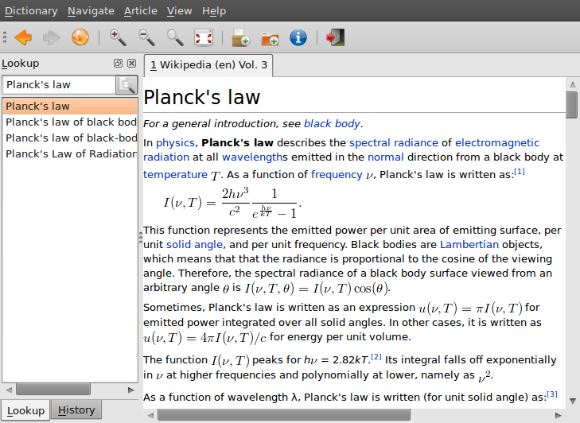

   Default layout (Ubuntu).

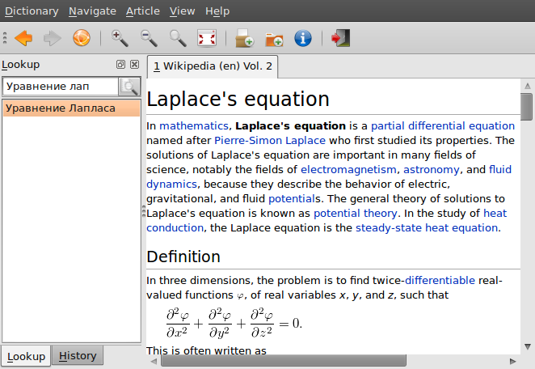

   Article in English Wikipedia foung by corresponding title from
   Russian Wikipedia (language link support) (Ubuntu).

.. figure:: aarddict_0.8.0_ubuntu_hydrogen.png
   :scale: 50
   :align: center

   Modified layout with history pane below lookup (Ubuntu).

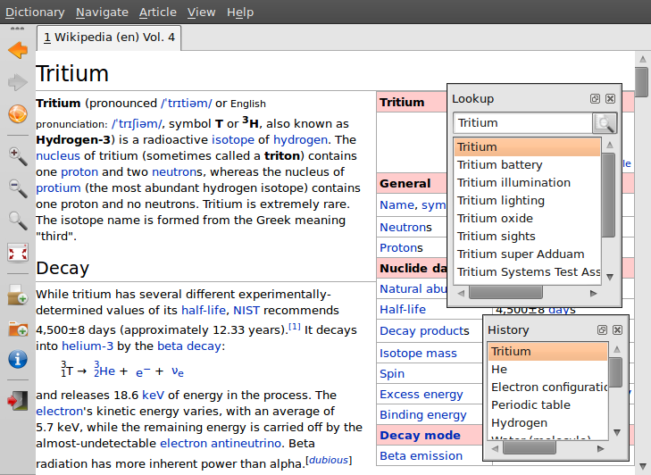

   Modified layout with vertical toolbar and floating lookup and
   history panes (Ubuntu).

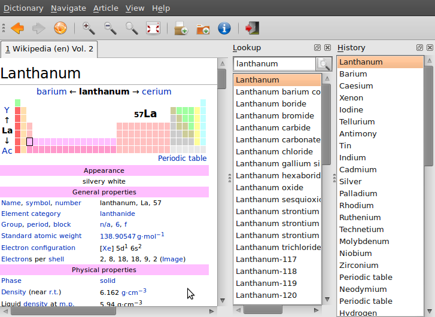

   Modified layout with lookup and history on the right side next to
   each other (Ubuntu).

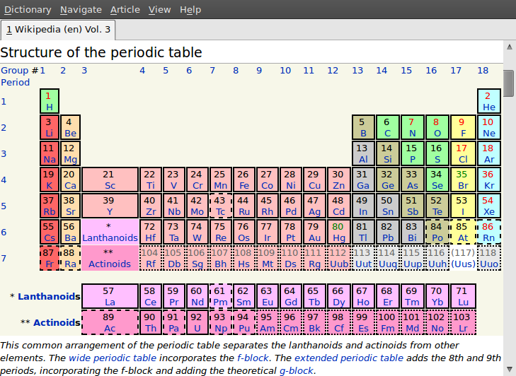

   Modified layout with lookup and history hidden (Ubuntu).

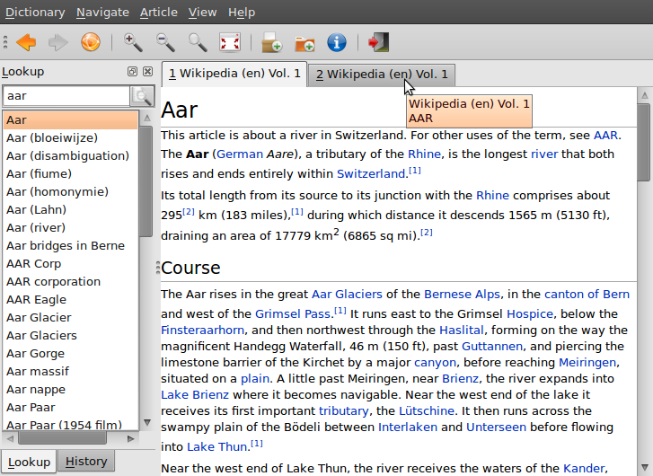

   Multiple articles with similar title found in the same dictionary (Ubuntu).

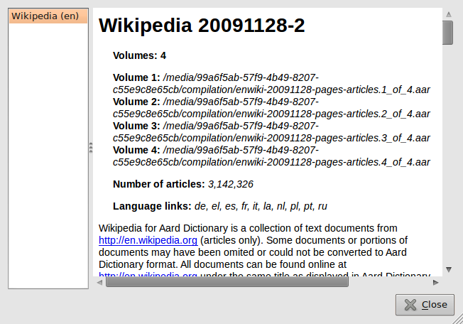

   Dictionary information dialog (Ubuntu).

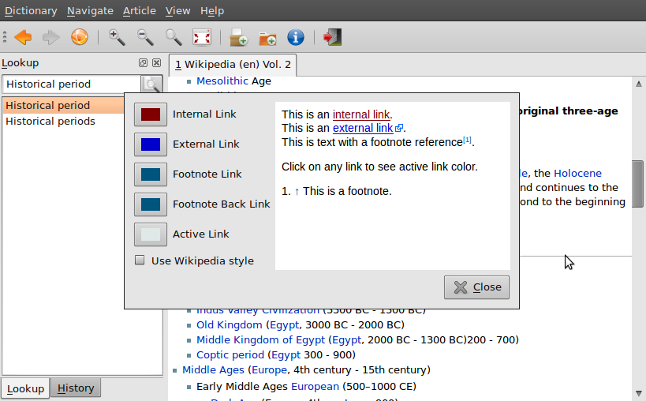

   Dialog for customizing article's visual style (Ubuntu).

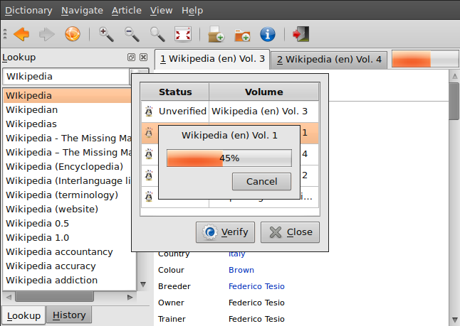

   Verifying volume data integrity (Ubuntu).

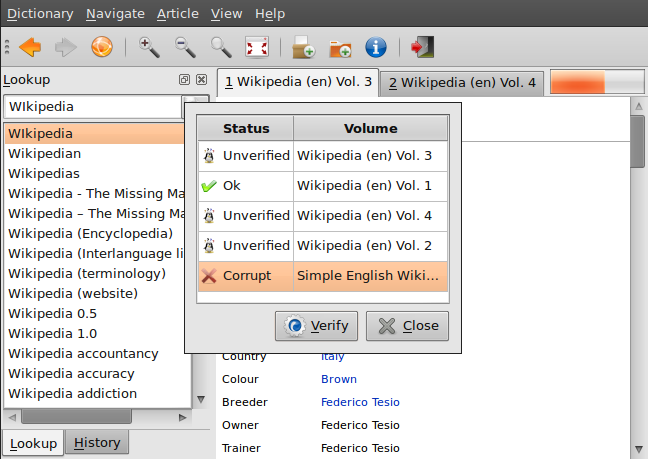

   Dialog for verifying volume data integrity (Ubuntu).

0.7.x
=======

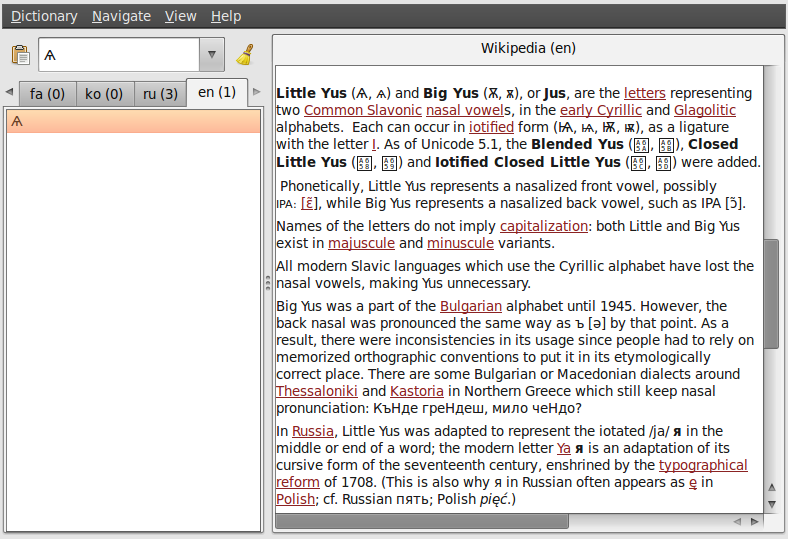

   Aard Dictionary with Wikipedia in multiple languages open showing
   article in English Wikipedia (Ubuntu).

.. figure::  aarddict_0.7.6_ubuntu_enwiki_full_table_small_font.png
   :scale: 50
   :align: center
   
   Aard Dictionary showing simple table full screen in small font.

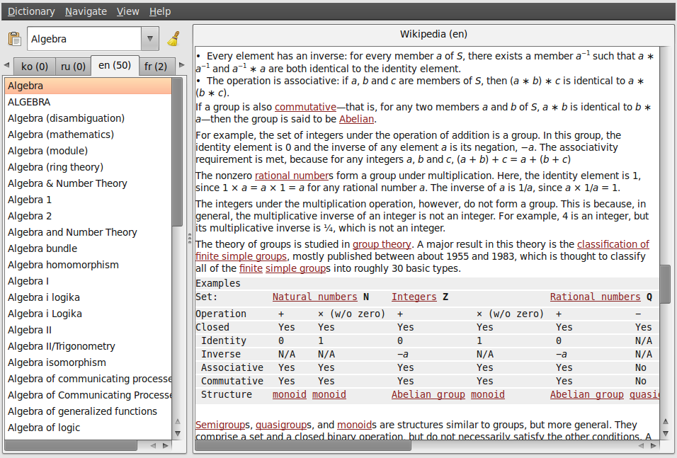

   Aard Dictionary showing English Wikipedia article with simle math. 

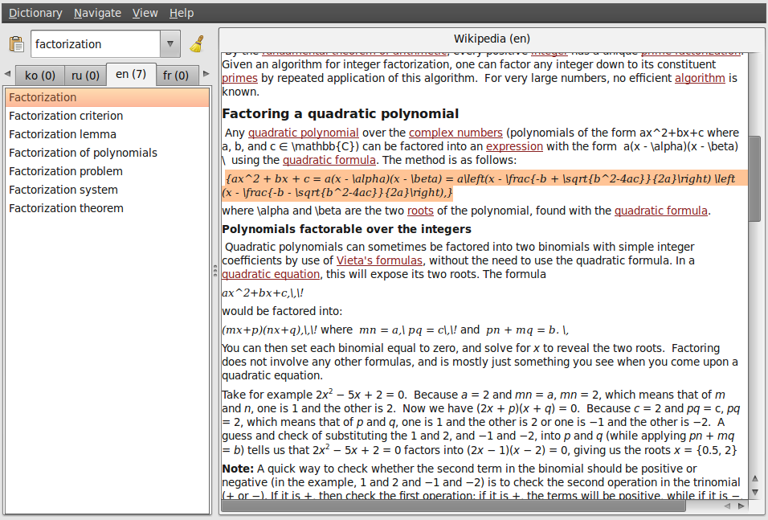

   Aard Dictionary showing English Wikipedia article with 
   math markup (LaTeX). LaTex markup is not rendered, but can be
   copied and rendered by an external program.

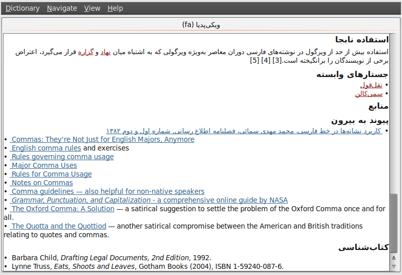

   Aard Dictionary with word list turned off displaying article from
   Persian Wikipedia (Ubuntu).

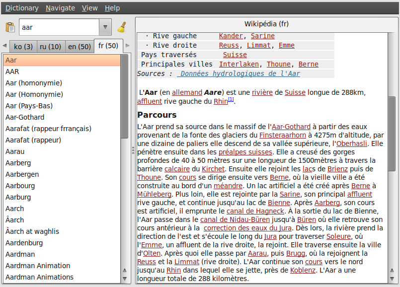

   Aard Dictionary with Wikipedia in multiple languages open showing
   article in French Wikipedia (Ubuntu).

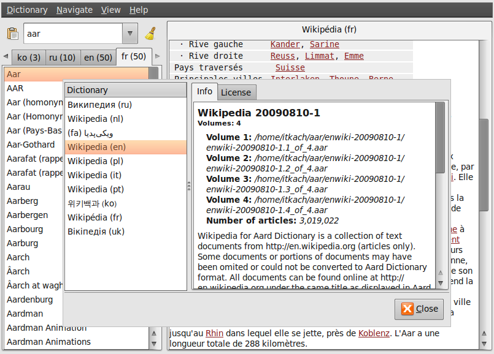

   Aard Dictionary information dialog showing list of open Wikipedias
   (Ubuntu).

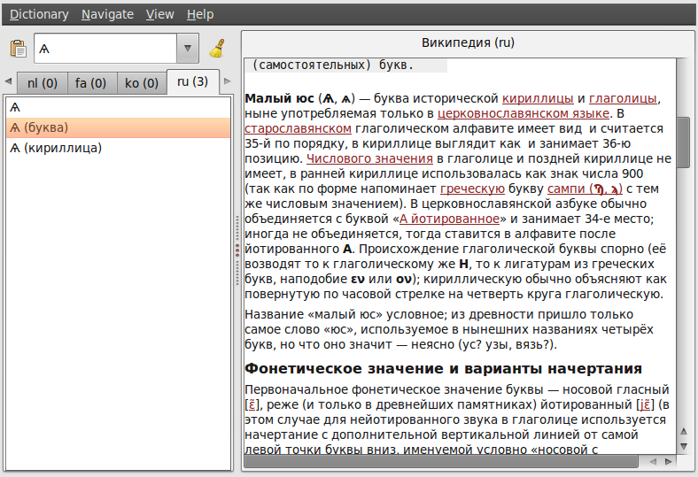

   Aard Dictionary with Wikipedia in multiple languages open showing
   article in Russian Wikipedia (Ubuntu).

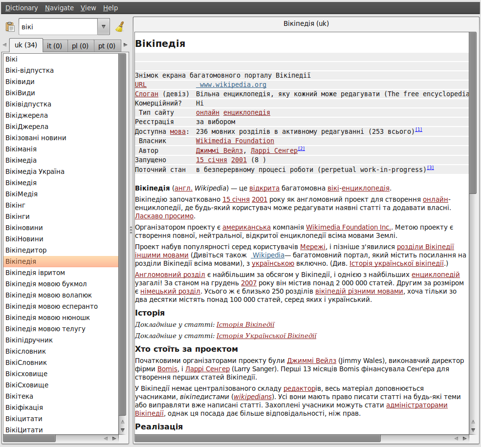

   Aard Dictionary with Wikipedia in multiple languages open showing
   article in Ukrainian Wikipedia (Ubuntu).

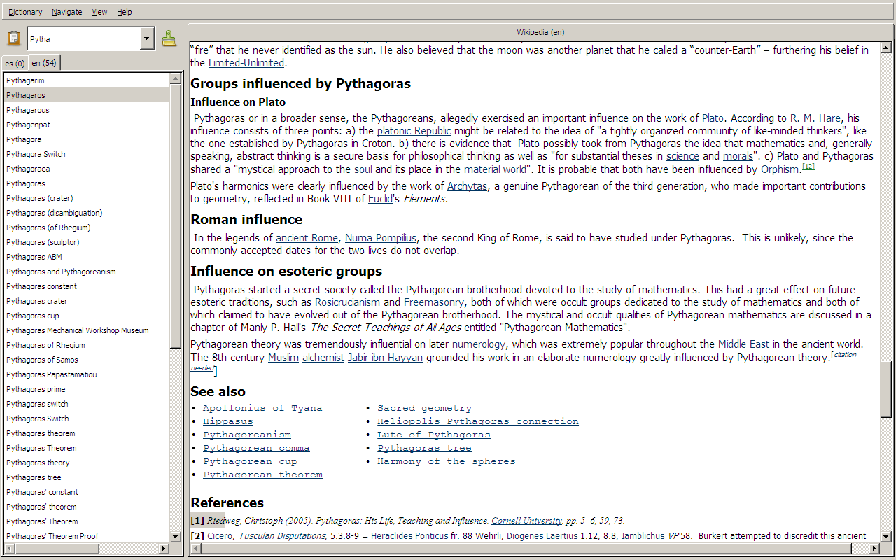

   Aard Dictionary showing article in English Wikipedia fullscreen (Vista).

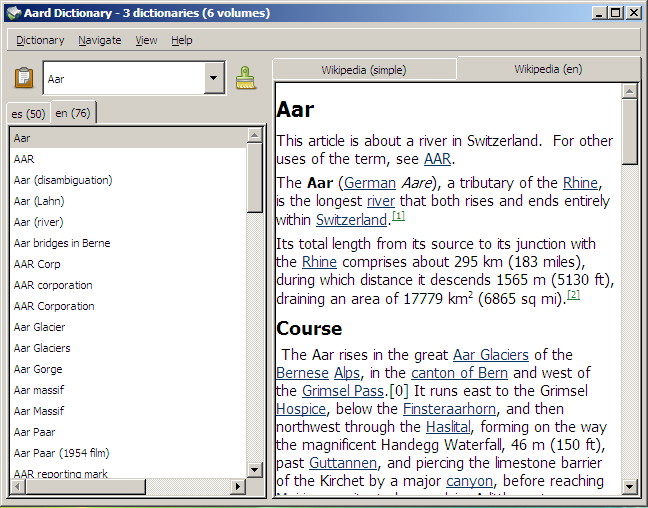

   Aard Dictionary with multiple Wikipedias showing
   article found in multiple dictionaries (Vista).

.. figure:: aarddict_0.7.6_vista_kowiki_color_dialog.png
   :scale: 50
   :align: center
   
   Aard Dictionary with multiple Wikipedias showing
   article found Korean Wikipedia and link color customization dialog
   (Vista). 

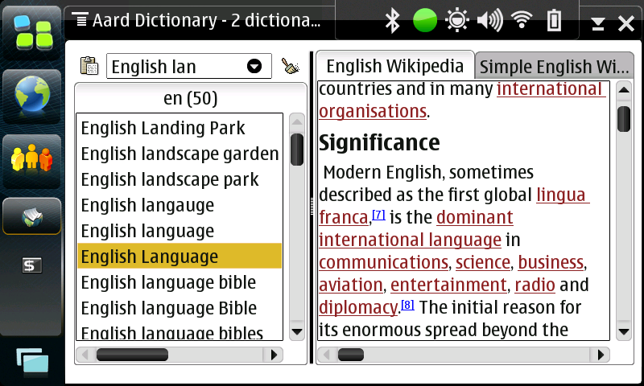

   Aard Dictionary with multiple Wikipedias showing
   article found in multiple dictionaries (Maemo 4).

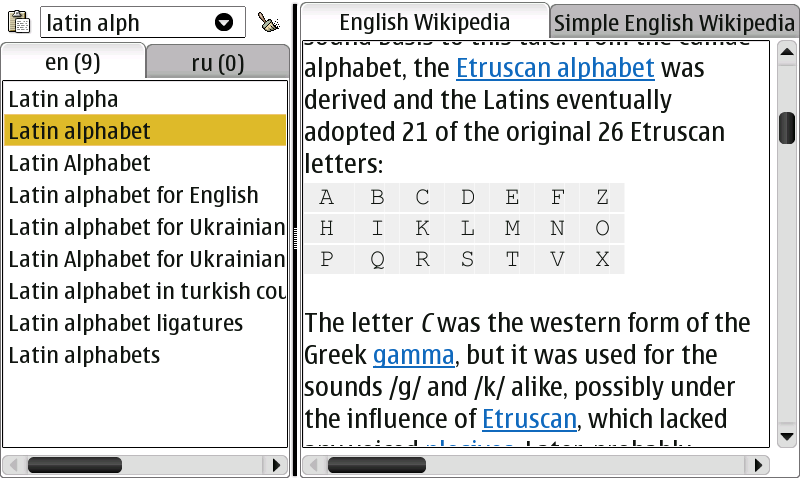

   Aard Dictionary with multiple Wikipedias showing fullscreen 
   article with small table found in multiple dictionaries (Maemo 4). 

